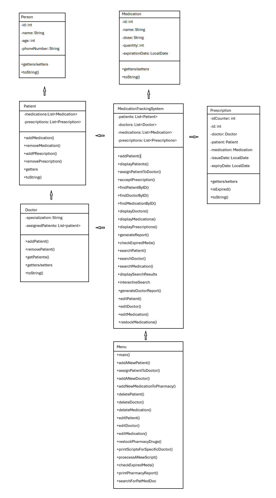

# JAVA_NAAA_MID
Mid-term group sprint for Java - Pharmacy Management System

# Pharmacy Management System Documentation

## 1. User Documentation

### Overview

This Pharmacy Management System is designed to manage patient information, medications, prescriptions, and doctor-patient relationships efficiently. The system follows Object-Oriented Programming (OOP) principles and includes various functionalities such as adding, editing, searching, and generating reports.

### Classes and Their Functionality

#### 1. **Person (Super Class)**


- **Attributes:**
  - `ID`: Unique identifier
  - `Name`: Full name of the person
  - `Age`: Age of the person
  - `Phone Number`: Contact information

#### 2. **Patient**

- Inherits from `Person`
- **Attributes:**
  - List of medications the patient is taking
  - List of active prescriptions

#### 3. **Doctor**

- Inherits from `Person`
- **Attributes:**
  - Specialization field
  - List of assigned patients

#### 4. **Medication**

- **Attributes:**
  - `ID`: Unique identifier
  - `Name`: Medication name
  - `Dose`: Dosage in mg
  - `Quantity in Stock`: Inventory count
  - `Expiry Date`: Randomized date including past dates

#### 5. **Prescription**

- **Attributes:**
  - `ID`: Unique identifier
  - `Doctor`: Associated doctor
  - `Patient`: Associated patient
  - `Medication`: Prescribed medication
  - `Prescription Expiry`: Defaults to one year from issue date

#### 6. **MedicationTrackingSystem**

- Manages the entire system
- **Functions:**
  - Search for drugs, patients, and doctors
  - Add/edit/delete medications, patients, and doctors
  - Accept and link prescriptions to patients
  - Generate various reports (all data, expired medications, prescriptions by doctor)
  - Restock pharmacy inventory

#### 7. **Menu**

- Provides a user interface via the Scanner class
- Allows interaction with system functionalities

### How to Use

- Run the program through the `Menu` class
- Use the menu options to manage medications, patients, doctors, and prescriptions
- Generate reports for system overview

### Class Diagram

(*Include a UML diagram showing class relationships*)



---

## 2. Development Documentation

### Source Code Structure

- `JAVA_NAAA_MID/` : Contains all files

### Build Process

1. Navigate to the project directory
2. Compile using:
   ```sh
   javac -d bin JAVA_NAAA_MID/*.java
   ```
3. Run the application:
   ```sh
   java -cp bin Menu
   ```

### Compiler-Time Dependencies

- Java Development Kit (JDK 11+)
- No external libraries required

### Development Standards

- Follow Java Naming Conventions
- Utilises camelcase for methods
- Comment methods using Javadoc

### Database Design (Theoretical)

| Table Name    | Attributes                                    |
| ------------- | --------------------------------------------- |
| Patients      | ID, Name, Age, PhoneNumber                    |
| Doctors       | ID, Name, Specialization, PhoneNumber         |
| Medications   | ID, Name, Dose, Quantity, ExpiryDate          |
| Prescriptions | ID, DoctorID, PatientID, MedicationID, Expiry |

(*Include an entity-relationship diagram*)


### Repository Access

- Clone the repository from GitHub:
  ```sh
  git clone https://github.com/Noah-Hickey/JAVA_NAAA_MID.git
  ```

---

## 3. Deployment Documentation

### Installation Steps

1. **Ensure Java is Installed**
   - Check installation:
     ```sh
     java -version
     ```
2. **Clone the Repository**
   ```sh
   git clone https://github.com/Noah-Hickey/JAVA_NAAA_MID.git
   ```
3. **Compile and Run**
   ```sh
   javac -d bin JAVA_NAAA_MID/*.java
   java -cp bin Menu
   ```

### System Requirements

- Java 11+
- Minimum 2GB RAM
- 100MB storage space

### Troubleshooting

- **Java not found?** Install JDK from [Oracle JDK](https://www.oracle.com/java/technologies/javase-jdk11-downloads.html)
- **Compilation errors?** Check for missing or incorrect imports

---

## End of Documentation

